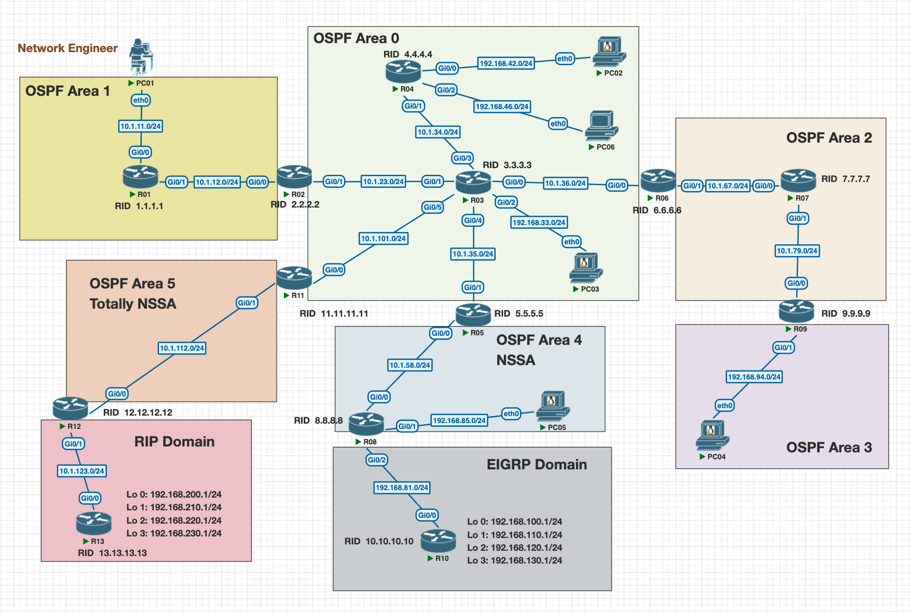

# OSPF_V8_Lab_Practice

## Purpose
Hello Internet! While preparing for the CCNP ENARSI exam, I decided to play around and create some labs of my own to test my understanding of each concepts. That is how this little project started. The goal of this repo is to help me or anyone out there learning through pratical example from theory and also based on my decade plus experience. Feel free to reach me on LinkedIn if you have any questions or recommendations
## Getting started

### Description
In this topology, there are multiple Area and only 3 protocols involved: OSPF, EIGRP and RIP.

### Images Used
- IOSv Version 15.8(3)M2
- VPCS built in images

### Addressing Table

| Router | Router ID | Interface | OSPF Area | IP Address / Network |
|------|------|------|------|------|
| R01 | 1.1.1.1 | Gi0/0 | Area 1 | 10.1.11.0/24 |
|  |  | Gi0/1 | Area 1 | 10.1.12.0/24 |
| R02 | 2.2.2.2 | Gi0/0 | Area 1 | 10.1.12.0/24 |
|  | | Gi0/1 | Area 0 | 10.1.23.0/24 |
| R03 | 3.3.3.3 | Gi0/1 | Area 0 | 10.1.23.0/24 |
|  |  | Gi0/3 | Area 0 | 10.1.34.0/24 |
|  |  | Gi0/0 | Area 0 | 10.1.36.0/24 |
|  |  | Gi0/2 | Area 0 | 192.168.33.0/24 |
|  |  | Gi0/4 | Area 0 | 10.1.35.0/24 |
|  |  | Gi0/5 | Area 0 | 10.1.101.0/24 |
| R04 | 4.4.4.4 | Gi0/1 | Area 0 | 10.1.34.0/24 |
|  |  | Gi0/0 | Area 0 | 192.168.42.0/24 |
|  | | Gi0/2 | Area 0 | 192.168.46.0/24 |
| R05 | 5.5.5.5 | Gi0/1 | Area 0 | 10.1.35.0/24 |
|  |  | Gi0/0 | Area 4 (NSSA) | 10.1.58.0/24 |
| R06 | 6.6.6.6 | Gi0/0 | Area 0 | 10.1.36.0/24 |
|  |  | Gi0/1 | Area 2 | 10.1.67.0/24 |
| R07 | 7.7.7.7 | Gi0/0 | Area 2 | 10.1.67.0/24 |
|  |  | Gi0/1 | Area 2 | 10.1.79.0/24 |
| R08 | 8.8.8.8 | Gi0/0 | Area 4 (NSSA) | 10.1.58.0/24 |
|  |  | Gi0/1 | Area 4 (NSSA) | 192.168.85.0/24 |
|  |  | Gi0/2 | EIGRP Domain | 192.168.81.0/24 |
| R09 | 9.9.9.9 | Gi0/0 | Area 2 | 10.1.79.0/24 |
|  |  | Gi0/1 | Area 3 | 192.168.94.0/24 |
| R10 | 10.10.10.10 | Gi0/0 | EIGRP Domain | 192.168.81.0/24 |
| R11 | 11.11.11.11 | Gi0/0 | Area 0 | 10.1.101.0/24 |
|  |  | Gi0/1 | Area 4 (Totally NSSA) | 10.1.112.0/24 |
| R12 | 12.12.12.12 | Gi0/0 | Area 4 (Totally NSSA) | 10.1.112.0/24 |
|  |  | Gi0/1 | RIP Domain | 10.1.123.0/24 |
| R13 | 13.13.13.13 | Gi0/0 | RIP Domain | 10.1.123.0/24 |

### Disclaimer
- This is a lab topology and is in no shape and form representative of the topology with my current or formers employers.
- Before Using anything discuss here, please review with your team before applying it on a live network as each and every network behaves differently.
- This is Network Engineering, and there is no single way to achieve a goal. Our goal is to learn while developping an optimal way to achieve the same objectif.
